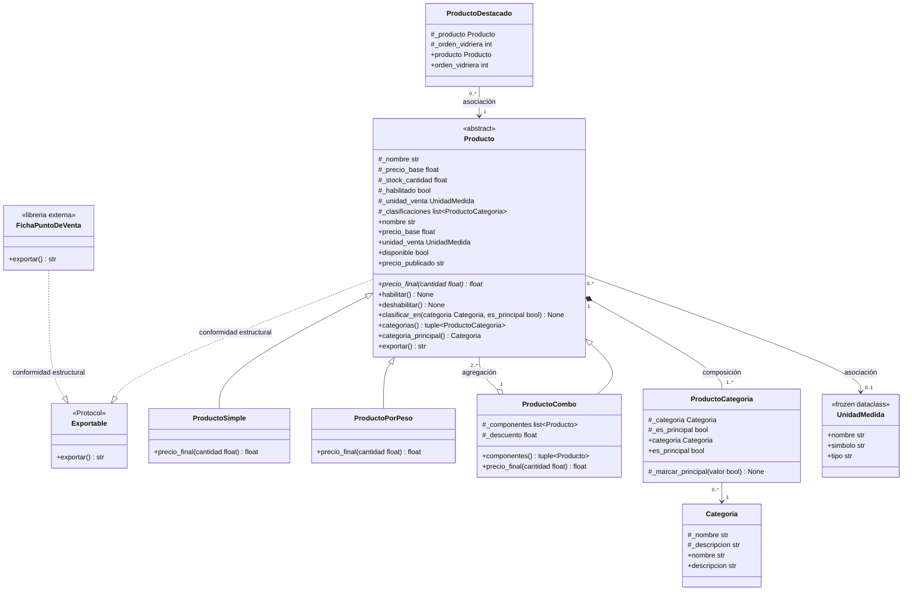

# Diagrama de clases — Food Store

## ProductoDestacado: asociación, no herencia

`ProductoDestacado` no hereda de `Producto`. Destacar un producto es un rol
promocional temporal (entra y sale de la vidriera según convenga), no una
forma distinta de vender: no define ninguna regla propia de `precio_final`.
Modelarlo como herencia obligaría a decidir qué precio tendría un destacado
o a crear una subclase destacada por cada tipo de venta (simple, por peso,
combo), multiplicando clases sin necesidad.

Con la asociación `ProductoDestacado "0..*" --> "1" Producto`, cualquier
producto del catálogo puede destacarse agregando una instancia de
`ProductoDestacado` que lo referencia y guarda su `orden_vidriera`, sin tocar
la jerarquía de ventas.

**Costo de la restricción.** Como un destacado no es un `Producto`, no
responde a `precio_final()` ni cumple `Exportable`: para calcular o exportar
se usa `destacado.producto`. La vidriera es una colección aparte que se
mantiene junto al catálogo, y el modelo no impide órdenes repetidos ni que
un mismo producto se destaque dos veces. Se acepta ese costo a cambio de no
duplicar la jerarquía de ventas en variantes "destacadas".
